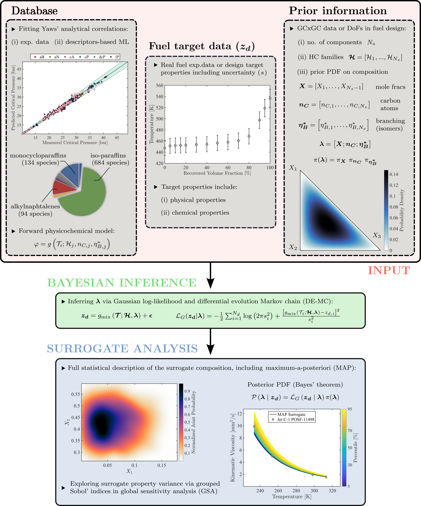

# BayeSAF: Emulation and Design of Sustainable Alternative Fuels via Bayesian Inference and Descriptors-Based Machine Learning


As part of mid-century net-zero carbon neutrality pathways, sustainable aviation fuels (SAFs) constitute the only viable decarbonization strategy for commercial aviation in the foreseeable future. Still, reliable prescreening of alternative jet fuels is crucial in facilitating the de-risking and scale-up of SAF production technologies. In the present study, we illustrate an innovative methodology to support the physicochemical characterization of emerging SAFs and to understand the impact on combustor operability figures of merit (FOM).


**_BayeSAF_ framework**: workflow description. We propose an innovative methodology for formulating physicochemical surrogate mixtures that emulate the properties of real jet fuel or drive alternative jet fuel design processes. First, we develop an extensive hydrocarbon property database (992 chemical compounds from 7 hydrocarbon molecular groups) encompassing individual components of candidate SAFs based on available experimental measurements and descriptors-based machine learning (DB-ML) techniques, addressing: (i) 8 lumped properties (critical temperature T<sub>c</sub>, critical pressure P<sub>c</sub>, critical molar volume V<sub>c</sub>, critical density ρ<sub>c</sub>, critical compressibility factor Ζ<sub>c</sub>, acentric factor ω, and derived cetane number _DCN_); 7 temperature-dependent thermophysical properties (liquid-phase density ρ<sub>l</sub>, liquid-phase dynamic viscosity μ<sub>l</sub>, liquid-phase isobaric specific heat C<sub>p,l</sub>, liquid-phase thermal conductivity k<sub>l</sub>, vapor pressure p<sub>v</sub>, surface tension σ, and latent heat of vaporization H<sub>v</sub>). Thereafter, the MATLAB<sup>©</sup>-based _BayeSAF_ algorithm resorts to the hydrocarbon property database and Bayesian inference techniques to formulate surrogate mixtures for alternative jet fuel emulation and design. 

**<u>USER-DEFINED INPUTS<u>** 

(i) target physicochemical properties (real fuel emulation or jet fuel design)

(ii) number of surrogate mixture components, N<sub>s</sub>
(iii) corresponding hydrocarbon molecular groups, ℋ

**What is _BayeSAF_ inferring then?**

_BayeSAF_ infers **λ** = [**X**; **n<sub>C</sub>**; **η<sub>Β</sub><sup>*</sup>**], i.e., a set of (3N<sub>s</sub>-1) compositional parameters - molar fractions, carbon atom counts, and normalized topochemical atom indices for branching - that univocally identifies mixtures comprising chemical compounds from the hydrocarbon property database. 

**What can I do to promote fast convergence?**

Setting informative prior probability density functions (PDFs) for the compositional parameters **λ**, based on GCxGC for real fuel emulation or chemical composition requirements from ASTM standards for jet fuel design.

**<u>OUTPUT<u>**

On the one hand, the primary outcome of the _BayeSAF_ algorithm is the most probable surrogate mixture composition in terms of molar proportions, carbon atom counts, and isomeric conformations, also referred to as the _maximum-a-posteriori_ (MAP) surrogate mixture. On the other hand, as the posterior PDF inherently provides a statistical description of the surrogate composition, a variance-based global sensitivity analysis (GSA) about the impact of individual groups of compositional parameters on the variance in key physicochemical properties might be carried out by resorting to grouped first-order Sobol' indices.

# Objectives

The _BayeSAF_ framework constitutes a robust methodology for carrying out alternative jet fuel emulation and design through the development of ad-hoc physicochemical surrogate mixtures that address the entirety of the target properties specified within the ASTM D1655 standard, which regulates the specifications for aviation turbine fuels. Notably, the Bayesian-inference-based surrogate formulation process provides a complete statistical description of the mixture composition, which might subsequently drive forward uncertainty quantification (UQ) in multi-fidelity numerical analyses - ranging from zero- and one-dimensional reduced-order models (ROMs) for vaporization and combustion characterization to three-dimensional reacting computational fluid dynamics (CFD) targeting preferential vaporization effects in realistic aeronautical combustion chambers - of SAF-fueled combustion systems, providing pushforward distributions of combustor operability figures of merit (FOM). In conclusion, we believe that _BayeSAF_ provides an end-to-end multi-fidelity modeling framework that may support fuel design and pre-screening of novel SAFs, facilitate the de-risking of emerging SAF production pathways, and alleviate existing barriers to the scale-up of the SAF industry.

# Example end-to-end application

Deep learning-based forward UQ on Bayes-informed sustainable aviation fuel surrogates: a case study on bio-jet fuel vaporization.


# How to cite

Liberatori J., Cavalieri D., Blandino M., Valorani M., and Ciottoli P.P., _BayeSAF: Emulation and Design of Sustainable Alternative Fuels via Bayesian Inference and Descriptors-Based Machine Learning_, Fuel (under review), 2025, https://doi.org/10.2139/ssrn.5049145.

```
@article{liberatori2025bayesaf,
  author       = {Jacopo Liberatori and Davide Cavalieri and Matteo Blandino and Mauro Valorani and {Pietro Paolo} Ciottoli},
  title        = {{BayeSAF: Emulation and Design of Sustainable Alternative Fuels via Bayesian Inference and Descriptors-Based Machine Learning}},
  journal      = {Fuel (under review)},
  year         = {2024},
  doi          = {10.2139/ssrn.5049145}
}
```
Copyright (C) 2025 Jacopo Liberatori - All Rights Reserved. You may use, distribute and modify this code under the terms of Prosperity Public License.
